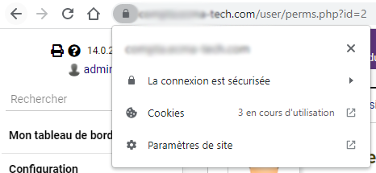

#Dolibarr with Nginx https as proxy pass using certbot
The purpose is to add an nginx container and a certbot container to auto generate SSL certificates

###containers

- 1 container for Dolibarr original image running on apache 2 port 8181
- 1 container for DB (mysql8 here)
- 1 container for Certbot
- 1 container for Nginx proxy pass and certificates regeneration, forwad port 443 using certificate to 8181 dolibarr

Bonus, in this example docker will auto check and regenerate certificates (entrypoint command in certbot)

###Steps

1. Edit `.env` file
2. Edit `.init-letsencrypt.sh`  file line 8 and 11 replace example.com.
3. Edit `nginx/nginx.conf` and replace example.com
4. Exec `docker-compose up --build`
5. Exec `sudo ./init-letsencrypt`
6. Enjoy

###Troubleshoot

If the certbot certificate fail the challenge, comment line 17 to 29 in `nginx.conf` then redo operation 3 and 4. Then restore `nginx.conf` and restart docker `docker-compose down && docker-compose up -d`

###Credits

Based on medium article by Philipp https://pentacent.medium.com/nginx-and-lets-encrypt-with-docker-in-less-than-5-minutes-b4b8a60d3a71
